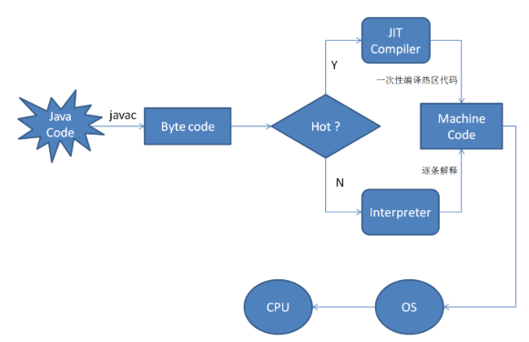

自昨日拿到Java核心技术，粗略翻了几十页。就已经发现了好多个之前不知道的点，所以就想着把这些点记录下来，就当做读书笔记了。

---

##### Tips1：

​	Java虚拟机可以**将执行最频繁的字节码序列翻译成机器码**，这一过程被称为**即时翻译**(Just in time , JIT技术)。就像是C++中的inline函数，JVM还可以检测指令序列的行为，从而增强安全性。这是java为高性能做出的优化。关于JIT和这部分的内容还来自 [深入浅出JIT](https://www.ibm.com/developerworks/cn/java/j-lo-just-in-time/index.html) 

首先我们大家都知道，javac(java的编译器)将java程序编译成字节码，JVM通过解释器将字节码翻译成对应的机器指令，逐条读入，逐条解释翻译。很显然，经过解释执行，其执行熟读必然会比可执行的二进制机器码要慢很多。为了加快速度，所以引入了JIT。

在运行时JIT会把翻译过的机器码保存起来，以备下次使用（对应开头说的，将执行最频繁的字节码序列翻译成机器码）。

*这篇文章讲的非常的好，虽然我看不太懂(尴尬了)，但是根据我博览各种各式的文章经验来看，这样的内容绝对是优秀的。*

##### Tips2：

​	在Java中int类型永远都是 4个字节(32位)，而学过C/C++的同学们都知道，它们的数据类型如int的字节数是取决于机器的CPU，所以在很多程序中会出现在一个机器上运行的好好地，换一个环境内存就溢出了。而Java的数据类型具有固定的大小，为它的可移植性助力。顺便说一句，java并没有C++中的unsigned 修饰符。

| 类型   | 存储需求 |
| ------ | -------- |
| int    | 4字节    |
| short  | 2字节    |
| long   | 8字节    |
| byte   | 1字节    |
| float  | 4字节    |
| double | 8字节    |

很意外是不是，long的长度竟然和double是一样的，我一直以为double比long长，(by the way: x=2.4 默认是double类型，x=2.3f 有f后缀才是float类型) ，长整型数值后面也会有L后缀，x=300000000333L

在很多时候我们并不会使用byte和short类型，它们应用于特殊的场景，例如，底层文件的处理或者需要控制占用大量的存储空间量的大数组。

java中还可以直接赋值 十六进制数，a=0xAB13 。八进制容易混淆所以不常用，也可以在数字中加入_ 表示数值更清晰，int x=1_000_000; 编译器会自动忽略_   。 十六进制中表示指数用 **p ,如 a=0x1.0p-3  指数用十进制表示**

Double.POSITiVE_INFINITY 正极值，Double.NEGATIVE_INFINITY 负极值。

尽管double的精度已经很高了，但是在无法接受舍入误差的金融计算领域仍然是不够的，所以java提供了BigDecimal类，用于无误差计算

char原本用于表示单个字符，不过现在用来表示Unicode字符，有时Unicode需要两个char值来表示，像是中文，

boolean布尔类型只有两个值：true和false ，不能用整型来赋值 如 boolean s=0; 是错的，C++是可以的。

对于浮点数的算术运算，实现这样的可移植性是很困难的。double类型使用64位存储一个数值，而有些处理器使用80位的浮点寄存器。这些寄存器增加了中间计算过程的计算精度，将结果存在**80位的寄存器中，最后将其截断为64位存进内存，这和64位机器上的计算结果不一致。**

所以jvm规定所有的运算都必须进行截断，而有时不能进行精确运算的结果会溢出，截断操作耗时间所以效率也比较慢，于是规定使用 `strictfp` 关键字来说明该区域（类，方法）中的所有运算都必须使用严格的浮点运算。

##### Tips3：

​	声明一个变量必须用赋值语句对变量显示初始化，如果没有编译不能通过。java不区分声明和定义。使用final来定义常量而不是const，

final如果修饰类，那么这个类不可以被继承

final如果修饰方法，那么这个方法不可以被重载

final如果修饰变量，那么这个变量不能被改变

在java中还有finally，finalize 两个关键字，它们和final的差别还是很大的。

finally是try{}catch{}finally{} 捕获异常的代码块中最后无论有没有异常，都必须要执行的区域

finalize：是Java垃圾回收前，必须执行的代码块

##### Tips4：

取模运算可以适配除了boolean类型的其他数据，还支持负数的取模。很多时候我们需要使用Math.里的方法，但是一般我们都是这么用的	`Math.pow(2,Math.sqrt(2))` 在这一行代码中就写了两个Math，比较麻烦，如何引入Math呢，	`import static java.lang.Math.*;`

Math类中的哪些静态方法都是为了追求速度，为了达到最快的性能，所有的方法都使用计算机浮点单元中的例程。如果需要的是一个完全可以预测的结果比速度更重要的话，可以使用**StrictMath** 类。

数值转换是我们经常遇到的问题，计算的时候java会自动帮助我们转换它们的类型，按照顺序进行，

1. if (操作数中有double) 其他操作数会转为double

2. else if (操作数中有float) 其他操作数会转换成float
3. else if (操作数中有long) 其他操作数会转为long
4. else if (                     int)                               int

很明显顺序是  double>float>long>int  

强制类型转换，例如 (int) 3.7  会造成精度损失，结果为3，如果想让其损失的小点，那么可以加上 (int) Math.round(3.7)  结果是4 ，因为round函数返回的是long所以还是要强制转换。如果将其转换时超出了表示范围，如 (int) 294883109313904  ,就会造成溢出，实际值会发生变化。

