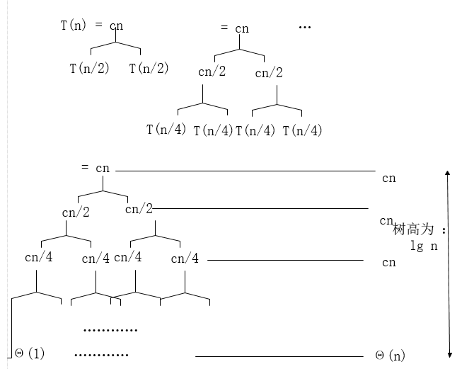

### 算法导论第二章：Getting Started

---

>  *本来打算在Coursera里听这门课的，可是要跨网youtobe，还是看网易云标清吧：* 

本系列文章：主要分两个部分 1. 在视频里听到我认为重要的知识点  2.《Introduction to Algorithm》的课后练习

---

#### Part I: 

​	算法分析是关于计算程序性能和资源利用的研究：特别关注性能。当然还有其他内容，比如内存，硬盘。

在程序设计方面什么是比性能更重要的呢？

- 正确

- 简洁，用户友好，可拓展

- 可维护 。健壮性。功能性。模块化。安全....


​	**似乎在软件开发的过程中很多其他的东西都比性能要重要** ，按这样的说法，我们似乎没有必要学习算法，去学习更重要的工程化。There are several reasons down here:

> 算法将不可行变为可行，如果这件事几年前已经有人做过了，从某种方面来说性能的确不是太重要。
>
> 算法是一种描述程序行为的语言，对的已经形成了一种理论语言了并广泛应用于计算机科学领域。

​	性能在计算机领域扮演的角色就好像**货币在经济领域中的角色**，我们可以用人民币购买我们日常生活的必需品，从某种意义上来说 货币 本身并没有价值，水，食物都比货币重要。**因为它是衡量的一般性标准，可以说牺牲了多少性能换来了安全，换来了功能，换来了用户友好....** 

​	讲完了为什么要学习算法，接下来就用一个小例子(插入排序)： [代码在这->](https://github.com/krystalics/algorithm/blob/master/src/com/company/chapter2/Insertion_sort.java)  

```C
INSERTION-SORT(A)
1 for j = 2 to A.length  // 下标从1开始计算
2 	key = A[j]
3 // Insert A[j]  into the sorted sequence A[1...j - 1]
4 	i = j - 1
5 	while i>0 and A[i] > key
6 		A[i+1] = A[i]
7 		i = i - 1
8 	A[i+1] = key
```

举个例子： 8，4，3，2，9 

>  8 **4** 3 2 9
>  4 8 **3** 2 9
>  3 4 8 **2** 9
>  2 3 4 8 **9**
>  2 3 4 8 9

这是一个简单的算法，就不拘束于细节了。**现在我们讲下如何对一个算法进行分析：**

##### Running Time： 算法运行时间

- 取决于输入本身（有时候，输入的数据已经是经过粗略的排序了）
- 取决于输入的规模，要知道处理 6个元素和60亿个元素的时间绝对不是一个量级的
- 运行上界，最坏的情况是多长时间


运用数学知识对其中一些情况进行参数化：

最坏的情况：T(n) = max time on an array input of size n

平均时间： T(n) = expected time（加权平均） on an array input of size n 

​	由于我们不知道**输入的概率分布，也没办法知道它的加权平均数** ，所以我们做出假设每个元素出现的概率都是相同的。当然还可以有其他假设，这里就不纠结概率论的东西了。

​	我们说的性能，包括速度 都是相对速度。往往计算机直接的计算能力是大相径庭的，只有在相差无几的条件下的速度才是有意义的。如何分析呢？我们通常采用  Asymptotic analysis 渐进分析

1. 忽略机器差异

2. 我们只关注增长情况，T(n) as n->infinity

   采用一些渐近符号 例如：θ - notation  ： 舍去低项和常数，例如：

> 3n^3-9n^2+4324235=θ(n^3) 

​	从数学的角度来看：当n充分大的时候，总有θ(n^2) 比 θ(n^3) 要快，如下图示


从工程学的角度来看：有时候θ(n^3) 要更好用些，这要看输入的情况。

让我们回到之前的问题，考虑以下插入排序的最坏情况要做多少次操作：**θ(n^2) 这种多项式级别的一般叫做 算术级别(Arithmetic series)，区别于指数级别  。** 对于大规模的n 是不够快的，所以下面讲个快点的，

#### **归并排序。** 

```C
Merge sort A[1...n]  // 下标从1开始
1. if n=1 ,done
2. Recursively sort（递归排序）
	A[1...n/2] and
	A[n/2 +1...n]
3.Merge 2 sorted lists
```

**关键子程序在于 归并**：下面举个例子

```
20   12
13	 11
7	 9
2	 1  这里由两个已经排好的list ，首先对比两个队首元素，取小的那个推进最终结果

push(1)  , 然后将 1 跳过，再对比两个队首，2 和 9 
push(2)  , 7 和 9 
push(7) ....直到

```

**每一步只关注两个元素，都是固定数目的操作。所以对总数为n的输入，把这两个队列归并的时间是θ(n) 线性时间。** 第一步的时间省略了，因为它只有一个操作，比较 n==1?  

 假设为n个元素排序需要T(n)的时间，那么我们现在需要关注的是 **递归** 的时间： **2T(n/2)** 它是分别的时间，为两个n/2元素排序。 最终得出的结果关于这个算法

​	**T(n)= 2T(n/2)+θ(n)  , n>1**    当 n ==1 时 T(n)=1 这没什么好说的 

实际上 θ(n) 可以用显式的 cn (c是常数)来表示 即  **T(n)= 2T(n/2)+cn  , n>1**   这实际上是个递归的式子。我们通过构造递归树的方式来求解方程；如下图示 ： **2^h=n  所以 h=lg n**

最终 **T(n)=(cn)lgn+θ(n)  （θ(n)属于低项，舍去）**

​	        **=θ(nlgn)**


---

#### Part II:

从 插入排序开始：[代码在这->](https://github.com/krystalics/algorithm/blob/master/src/com/company/chapter2/Insertion_sort.java) 

具体的证明过程我就不太懂了，这里介绍一下它的特性：对于少量的排序它是一个有效的算法，将整个元素集**分为两部分，**第一部分是已经排好序的(默认升序排列)，另一个部分是散乱的。

分析：很明显**当第一部分只有一个元素时，它是有序的**。而我们的排序也从这里开始，按顺序从第二部分抽出一个元素**i**，让其与第一部分的最后一个元素**j**(最大的那个)比较，if j>i 那么就将j元素后移一位，到达i元素的位置，接着继续从第一部分的最后一个元素(原本j的前一个)与i的值比较，，，直至第一部分没有元素了那么i就是第一个，或者在中途有个元素比 i 的小，那么就将它插到那个元素的后面一位。

循环之下，直至第二部分没有元素。


##### 练习  ：代码都在上面那个入口

##### 2.1-2 重写程序，使其按照降序排列。

​	降序排列  只需要将 while中的 A[j]>key 换成A[j]<key 即可 

##### 2.1-3 考虑以下查找问题：

​	输入：n个数的一个序列A=[a1,a2,,,,an]和一个值 v

​	输出：下标i 使得 v=A[i] 或者 当v不在A中出现时，v=null 

​	写出线性查找的伪代码， 使用一个循环不变式来证明你的算法是正确的。(即确保循环不变式瞒住三条必要性质。)

**答案：** 其实这是很简单的遍历，关键在于是要用循环不变式证明算法正确性。于我个人而言，觉得不重要，就没写。


##### 2.1-4 考虑将两个n位二进制整数加起来的问题，分别存储在两个n元组A,B中，结果存储在(n+1)元组C中，给出伪代码

```java
for(int i=n-1;i>=0;i--){
    switch(A[i]+B[i]){
        case 0:C[i+1]+=0;break;
        case 1:C[i+1]+=1;break;
        case 2:C[i+1]+=0,C[i]+=1;break;  //有进位
    }
}
差不多就是这个思想，具体细节就不深究了。
```

