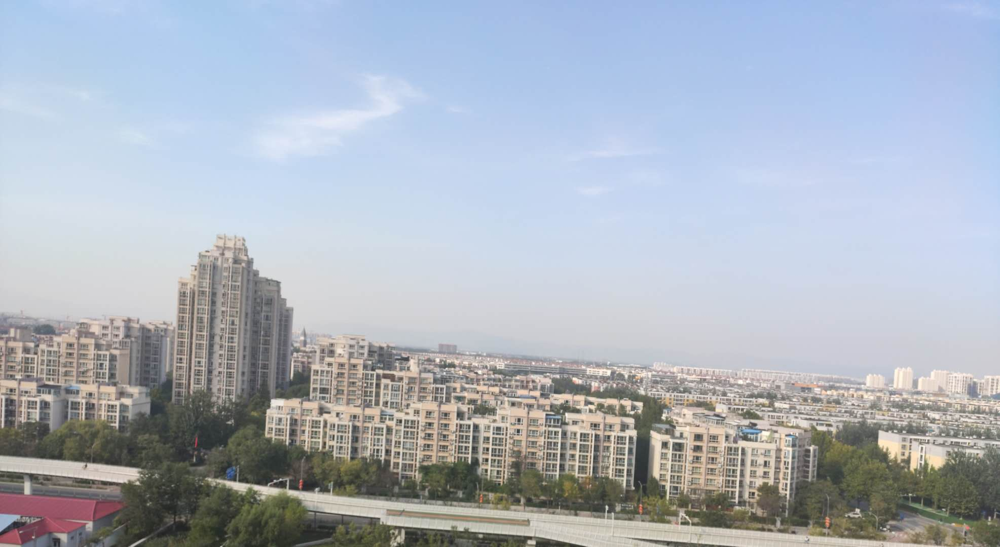

### 第八章：天涯

“儿子，我周末要出差一趟。这两天你在家里好好的啊！微信转你200块钱，这几天别饿着自己啊！”

临虚脑子一转：这段时间因为学校那事儿，挺郁闷的，趁父亲出差我也出去转转吧。嘴上也不忘回答 “好的，知道了！” 

第二天周六待父亲走后，背上紫荆，拿上手机，准备轻装上阵的临虚突然觉得有点奇怪，总感觉手机和紫荆不是很配。大概5分钟后，身着白色T恤搭了一个灰黑相间的外套，浅蓝色牛仔，白色帆布鞋，黑色的鸭舌帽，背着一个卡其色的小提琴箱子出门了。之前学校检查的时候，临虚头发太长被强制剪了个短发、配上清秀的面庞有一丝俊美，加上这身装备很是青春洋溢。

踏出小区门外的时候还是早晨9点钟，抬头看了看今天的天气：“嗯，nice！” 本来想先查一下J市的地图的，但是想了想又不是做任务，只是出去放松一下而已。选了一条和平常坐公交相反的方向，就开始用脚丈量这座城市。看着路边形形色色的建筑，虽然不是第一次见，虽然它们长的差不多，但是当沉下心来去看它们，充满了数学与建筑上的美感。于是从怀里拿出个小笔记本：**建筑是静态三维空间的艺术，加上时间维度或许可以形成传说中的位面**。如果说建筑是静态的空间艺术，那么汽车就是移动的工业艺术，里面精巧的结构不亚于任何的法阵。

此时天空传来呼啸声，她抬头看见一架飞机从头顶的上空掠过，又在本子上写上：**很难想象这个世界不依靠灵力就能够征服天空，有机会一定要去坐一趟。**

这一走就是到中午，沿途记下了很多东西，果然是尽信书不如无书！“老板，来个不加洋葱的烤冷面！”，站在移动摊位前面手上还拿着上个摊位买的烤肠，她来到了一条小吃街，看着人来人往且空气中弥漫着美食的气味，写下：美味的食物果然是美好心情的最大来源。坐在一个摊位等云南米线的时候，安静的听着周围的喧嚣，听见老板夫妻在争吵孩子应该上哪所学校，听见有女孩发出银铃般的笑声，听见食物在沸腾的汤中翻滚，听见对面烧烤的老板招呼客人，听见老板说米线好了。

这样的生活她憧憬了好久，喧嚣中带着生活的平静，她可以置身于熙熙攘攘之中而不是像一个局外人一样，此刻她就像是一个普通的少年，如同在培训班刚练完琴、正在小吃街稍作休整，吃饱之后移步旁边的奶茶店点一杯不加糖的珍珠奶茶。窗外的阳光铺下来形成一道厚厚的毛毯盖在身上，很温暖、这份恬静让临虚有些醉了：**这个世界上除了阳光，还有什么值得我们追求呢？**

时间来到下午，她走到了J市的市图书馆。看着眼前这座艺术品，她闭上眼睛感受它的美感。”妈妈，那个哥哥在做什么啊？“，听到小女孩的精灵般的声音，”小朋友，我在感受它呀！每一座建筑都是设计师的心血，你闭上眼试一试能不能感受到这个设计师在说什么？“。

”真的吗？“小眼睛忽闪忽闪的，抬头看了看妈妈、”妈妈，我们一起闭眼吧！“。临虚嘴角一提，轻轻告别她们，走进它的身体，一道长廊仿佛通向知识的边界，一环一环都镌刻着这个世界的秘密。走到早就想了解的世界历史模块，她很想知道这个世界走过的历史，书籍是最好的老师、百度看到的文章都太零碎了太片面了，没有一个完备的体系。

略带昏黄的夕阳打在临虚的脸上，漫反射荡起了朦胧的一层光晕，临虚伸了伸懒腰，活动了下肩膀，转头看向了窗外的天空，在笔记上写下：**不论从时间、空间、相互作用等任何不同层面来看，自然都是包容一切的整体。地球的发展历程并不像一条平静的长河，规律地点缀着各种现象——《地球之美》**

出了图书馆后，又来到一家沙县小吃店内，“老板，来碗混沌面！清汤加葱不要香菜”。可能来的比较早，还没到晚上的高峰期，店内没什么人。选了个位置，将箱子放在旁边，准备整理一下今天的收获。对面就坐下了一个人，临虚皱了皱眉看下其他位置，是空的呀！

“小哥哥，能不能加个微信啊？”

“不好意思，我没有微信”

右侧坐着的2个女生开始大笑，”帅哥，别害羞啊！我们婷婷可还单身呢“。临虚嘴角有些抽搐，面带微笑就是不说话。“混沌面来了！” 临虚对着女生点了点头就开始蒙头苦吃了，她之前是没有考虑这点的：**我现在算男的还是女的？**，虽然在她有限的人生里，从来没有想过恋爱结婚，但是这样有性别认知错位的问题其实也是有点麻烦的，将苦恼化为食欲，快速结束战斗之后、结账走人。

苦恼这个也没什么用，对于解决不了的问题临虚从来不会关注，因为毫无意义。天色已经黑了，她准备去找乞丐去聊一聊，想亲眼看看这个国家的底层人民是个什么样的思维：**想要对这个世界认知的更全面，就需要接触不同层次的人，这样建立起来的世界观才会更加的宏大**。

又沿街边走了3个小时，硬是找不到乞丐的身影。身体却发来抗议，脚底估计起了血泡，虽然这点痛苦不算什么可是现在也没有任务，时间很充裕没有必要为难自己，乞丐可以明天再找嘛。刚好附近有一个公园，今晚就在里面休息一下。

找到公园里的长椅，拉开小提琴的箱子，里面除了紫荆还有一个毯子和小枕头。毕竟虽然能吃苦，但没有必要找苦吃嘛。由于在这个世界还没有遇到过危险，也不准备找一个相对隐秘的角落休息了，以她的感知如果有人靠近可以第一时间知道。

眼睛一睁，接着月光看见前面有个穿着破旧，手里拿着个灰色有几个破洞的毯子，头发沾满了泥土，蓬头垢面的男人站在长椅面前。“诶，新来的？这个位置昨天是我占的，你到边上去！”，被打扰睡眠的临虚本来很不爽，但是一看他的形象就精神了。上下打量了一下，“你吃饭的家伙呢？”

“滚，老子不是乞丐！我这是流浪，流浪你知道吗？看你这样子，也不像是我们这行的，赶紧滚！”，临虚此时已经坐起来了，也不管对方脏不脏，左手拍了拍旁边的空位示意他坐下。流浪汉骂骂咧咧的坐下 “哎哟，终于可以休息了，可累死老子了，你别不识相啊！赶紧滚！”，比这粗俗一万倍的话语临虚都听过，这些话在她耳中就像是温柔的风轻轻吹过。从怀里拿出早就准备好的50块，“想要这50块吗？聊一会儿，就是你的！”

>我已经忘记自己叫什么名字了，依稀记得别人叫我阿强。
>
>我为什么成为流浪汉啊，这可是一个好长好长的故事啊。
>
>那年过年，我从打工的地方回到家，我记得在火车站排了好久的队，提前一天就在火车站住下了，就想着能够回到老家过年。等我打开家门，却发现好大的房子里没有一个人，才记起来爹妈已经走了。那我回老家还有什么意思，那我排了好久的队还有什么意思，那我赚的钱给谁花，那我活着是为了什么...我那时候哭了好久啊，真的好久啊。第二天我就回到了城里，什么也没带，那年的冬天好冷啊，冷到我的骨髓里一直化不去。
>
>假如可以改变我成长过程中的任何事，希望有哪些改变？
>
>为什么要改变，我觉得现在挺好的呀。无拘无束，偷偷告诉你个秘密，当乞丐还挺赚钱的！我现在想做什么就可以做什么，你瞧不起我？没关系，我们不是一个世界的人，我觉得现在挺好的，什么都不缺，什么也都不需要。如果，我是说如果，真的可以重来，我希望年轻的时候多和父母说话，我希望教会他们用手机，我希望成为父亲的骄傲，我希望能找到人生的意义，我希望知道自己是为什么而活着。别看我现在什么都有，但是我没有心了

清晨，临虚拿着箱子走了。留下的是那个小枕头和毛毯，虽然阿强什么都有，也不影响他冷的发抖。走出公园的刹那，回头望了望、拿起手机 “喂，爸！你什么时候回来啊”，“臭小子，现在几点啊！明天！”。冷冷的清光打在身上，她紧了紧衣服，拿出笔记：**有些人流浪是因为没有房子，有些人流浪是因为没有家**。少年再次踏上了征程，这长长的道路好像蔓延至天边，永远没有尽头。

现在她好像有些明白，人为什么会组成一个社会，好像是因为交易，也好像是为了交流。当一个人从这个社会网络中脱离出来，成为了单个的节点，那种孤独和悲伤就好像是夜晚无尽大海的潮水，黑色又冰冷，一阵一阵涌来直到将他拉进那无边无际的深渊，吞噬他的内心——最终成为活死人。也好像明白了之前林虚为什么会想要融入群体，是因为他没有独自面对深渊的勇气，那种煎熬比受到校园霸凌还要痛苦。

来到这座城市最高的建筑已经是中午了，临虚选择这里作为最后一站，看向这座城市，鳞次栉比的楼宇就像是丛林中竞争阳光的树木、越高，生长得越好。远处隐约可见山的轮廓，像是亘古以来躺在城市边缘的城墙，守护着这座可爱的城市。

临虚对着天空大喊，“世界，我来了！”

---

吾心安处，是天涯也是家

