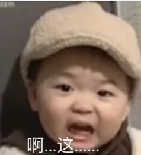

### 第十章：异界杀手-战国重演

第二天早晨，所有人在镇上一个大大的食堂中吃饭，都换上了统一的黑红色衣服。暂时脱离了危险的少年们在这个时候显现出了完全不同的状态、有的人好奇着看向周围的一切，有人一脸畏畏缩缩的样子，也有人就像是平常吃饭一样没有太多的动作。

而刚到这个世界的林虚心里苦啊，他想说话却发现根本找不到声带在哪、只是感觉到周围空气有轻微的震动却混乱不成体系，发出没有逻辑的短短续续的声音、但声音是偏少年声、整体听起来就像是一个说话不利索的外国人。此刻他已经完全明白自己是魂穿了，到了一个和地球完全不一样的世界、见识到了昨天那样血腥的场面顿时感觉自己没有了希望、活下去的机会渺茫到了极点！

无易明白这些人来到一个陌生的地方本身就很恐惧、昨天又被无臂的屠杀举动吓到、至今还笼罩在死亡的阴影之下根本无法进行下一步的训练。他很清楚现在最需要做的是什么！现在最重要的是激发起他们的求生欲以及对未来的向往！

“你们都是我天杀阁精挑细选的好苗子，昨天被杀掉的那些都是敌对势力派来的卧底！你们未来都是我阁的精英，还有机会学习贵族才能学习的文字和课程！所以你们不要怕，我们是不会害你们的。从现在开始，你们只需要完成我们指定的训练，就能够活着！就能够吃肉，吃大大的肥肉！如果你们足够优秀，我们还会满足你们所有的要求！无论你们想做什么都可以！” 他知道这干巴巴的口号并不能抚平此刻营地众人的慌乱，开始了下一步动作。

“昨天那个光头虽然是在清除卧底、但是他却借故杀人，已经背叛了我们的组织！！他昨天已经趁夜逃走了、只要你们努力训练在不远的未来就有机会手刃那个光头！” 无易昨天已经先让无臂离开了营地、出了这样的事情他已经不可能再把无臂放在边上了！

看着眼前还是战战兢兢的一群少年有些无奈、随手指了一个小胖子：“你，就是你，小胖子，你想要什么？”，小胖子终于忍不住哭了出来、一边哭一边喊 “我想回家！”、这一哭好像引爆了整个营地、顿时哇哇哇一片哭声响起。“给我闭嘴～～～”，周围的空气产生了巨大的震荡，所有人都被震住了！

“只要你们勤勤完成我们交给你们的任务，几年后就能够回去，到时候你们想干啥都没有人管！在这里你们能够学习文字，学习武功，学习如何更好的在这个世上活着！如果我们要杀你们，没有必要等到几年后，现在就完全可以！我们天杀阁在建安也算是首屈一指的大势力，只要你们好好干、几年后就能吃香的喝辣的！” 

又随手指着一个，用尽量温和的口气询问“小姑娘，你想要什么呢？”、十五从小就跟着老爹坑蒙拐骗加上天资聪颖，看出了这件事情并没有台上那人说的那么简单、但势比人强不得不回答对方想要的答案。“我，我想报仇！我爹在行商的时候被贼人杀了、我要他们偿命！” 毫不犹豫的编了一个谎、毕竟这算是看家本领了！

“自古杀人偿命、欠债还钱，等你学完了本事再回去亲手抓住那些贼人，以告诫你爹在天之灵！”，他趁热打铁 “昨天是我有事来晚了，让你们经历了如此大的危险、未能将你们完整的带出血炼我难辞其咎。让我们为死去的同伴默哀片刻！” 看着众人逐渐平复的心情无易心里松了口气，“我们绝不会放弃你们中的任何一位，就像十六号是来自异国不懂我们的语言，但是我会安排专门的人教导他、只要大家相信我就一定能走出这场困境，走向未来的美好生活！”这个操作更是直接赢得了众人的心。

还好他对于人心这块有足够的把握，先是直接给昨天死亡的人定性为卧底、在众人心底给他们分类营造出距离感来淡化死亡的恐惧，然后重拳出击直接把他们恐惧的源泉赶出了营地、又把未来的生活描述得天花乱坠、让众人恨不得立刻过上饭来张口衣来伸手的好日子。这一推一拉之间尽显老练、直击痛点，直接把还处于年少的20人镇得服服帖帖的！

“出拳，双腿半屈、蹲马步一刻钟！”

“起身、踢腿！”

无易此时也感到很难受，此前从未教导过完全没有基础的少年、他们的动作太难看了。他明白前面的一年还不宜开启生死的教学模式，否则到最后出来的成品基本功底会是致命的缺陷。现在可不是过去那种杀手都是野路子出来的蛮荒年代了，在天杀阁精细化的培养下，顶级的杀手如同韭菜一样一波又一波的涌现，归根结底就是形成了科学化的培养模式。

不要认为杀手是个单纯的武力职业，很多顶尖的杀手武功不一定是最厉害的，但是头脑一定是灵活的。这一切的基础都是从基础的文化教育开始的，作为培养了多年杀手的组织来说，有自己专门的渠道和方式来进行文化课的教授。这一点其实也算是杀手的福利了，在建安国想要学习文化知识可是需要很多投入的，大部分的百姓大字不识一个，贵族阶层垄断了上层所有的通道和特权。

林虚听不懂平时的训练命令、只能跟着别人做动作所以总是慢半拍，在武功方面跟着做就行所以没有单独开课程，其他人是直接开始上杀手需要具备的一些文化以及实践课程 诸如《野外求生》《毒药配比》《心理学导论》《社会学人文关系研究》等 而他就只能咿呀学语和众人的差距越拉越大，每天都到很晚才能完成一天的学习。身体和精神上的疲倦令他每次回去倒头就睡，根本没有心力去想自己如何能够逃离这里。但这次穿越他好像开了语言窍、学习语言方面特别的迅速、这或许是这具身体的本能吧。

第一个阶段内容主要是基础的武功以及文化部分、这里的文化并不是像地球上的数理化、主要以杀手可能面对的各种复杂场景为展开、涉及到非常多的细节掌控等。比如行动失败的撤离、如何利用目标的周围人，事和物来减少自己出手的次数 增加存活几率等等都是必学的内容，从中延伸出来的课程就好像是一个网络囊括了整个杀手教育的文化产业。每门课程都会有小型的环境模拟考试，力求在真实的环境下检验学习的成果、选拔出最优秀的杀手团队！这也是为什么血炼中会有这么个基础内容的存在、不仅是打基础更是培养团队的感情！

早晨天微微亮就被叫起来练功，练半个时辰才能够吃早饭；吃完早饭就开始学习文化知识、下午是集中练武的时候而晚上又是需要上课！得益于他高中生的学习能力也可能是穿越的过程中产生了变异、在一个月后基本能够说一些日常的词汇了、但是对于句子还是没有办法领悟，常常只能读懂一部分 把原本的意思曲解了。从原来完全不懂别人在说什么，到后面勉强能听懂几个词，这一切都让林虚倍感煎熬，在这陌生的国度说着陌生的语言，常常让他半夜被噩梦惊醒。

无易看他一个月就能够基本对话，就让十五号带着他进入了学习状态。此刻的众人和一个月之前可以说是判若两人了，浑身充斥着对力量以及知识的渴望，在天杀阁一整套培训体系下尤其是这些白板少年成长的非常快。完全不像是培养杀手的地方，气氛还挺和谐的。这也是无易刻意操纵的，在实施那项计划之前必须让营内众人的情谊处于良好状态。平时训练时就不断的强调他们是一个整体、所谓有福同享有难同当就是这样。

在逐渐走上正轨之后练功的过程加入了对抗部分、每人每天都会面对不同的对手、无易要求众人都全力出手、正所谓平时多流汗，战时少流血。在这种磕磕碰碰的情况下众人的感情飞速发展，很快一个营的人互相都成为了好朋友、而林虚每次都对抗中都是被打得最惨的那个，每天全身上下没有一块肌肉是不痛的。只有更多的这种拳脚上的接触才能快速的让众人打成一片。

“你们现在的流血流汗、不仅是为了你们自己能够更加的优秀，更是为了将来执行任务时能够更好的保护你们的队友！更好的完成你们心中的理想！”

也有赖于血炼中有一周一次的药浴，这种神奇的药浴可以清理身体的暗伤、让平时艰苦繁重的训练并不会影响他们后续的发展。这才是让众人放心搏斗的根本原因、林虚也很沉浸在这种与伙伴亲密无间的氛围里、这是他前世未能享受到的温暖。就这样无易成功的引导着这个集体 为他们设立了无臂这么一个共同的敌人让他们走向团结和稳定、更加全身心的投入血炼。无易最终的目的并不是带着他们所有人战胜乙丙两个营，只是目前来说这种环境和氛围是最有利于他们成长的。在林虚的感受来说就是地球上的班集体、在老师的带领下誓要拿下高考这座大山。

“这种药浴是我们天杀阁强大后勤保障的证明，你们现在要做的就是努力学习知识、努力打熬身体！在一年之后你们会开启个性化教学、每个人都可以学习自己感兴趣的方向！这是你们打破建安贵族垄断的最好机会！”

众人中唯有天生敏感且行走在底层世界多年的十五号感知到无易眼中微弱的异样、为此她在营中为自己设置的人设是全身心扑进报仇事业的天才少女，平时只是努力学习与训练并不在意其他。她知道手段强大的无易是比当初的光头更加恐怖的存在、如果被发现她当初回答问题时已经在撒谎、那么后果不难想象！所以她努力维持着被仇恨蒙蔽了双眼的形象，每天都是拼命的训练！不得不说、生命最大的价值就是活着了！

林虚现在明显感觉腰不疼了，也不大喘气了，练功的效果很明显的体现在众人身上。尤其是此刻和他打斗的十五，简直就是一个悍不畏死的变态！林虚已经观察十五很久了，平时孤僻、独来独往、听刚认识的小胖子说她好像身负血海深仇、因此格外的拼命。也不只是她、营地里还有其他的一些人因为各种各样的原因也是往死里练功。幸好天杀阁已经屹立多年，整个体系非常完善，有着一周一次的药浴来修补身体。

”十五姐，这次下手轻点呗。“ 林虚磕磕巴巴的说着、但是对面的少女似乎早就被仇恨蒙住了双眼、平时训练恨不得把自己练死在场上、根本听不进其他人的话。随着无易一声令下、场上众人瞬间和各自的对手扭打在一起。即使两世为人的他完全想不到十五的报仇情节是装出来的、不仅是为了圆当初的谎更是为了能够有机会能够活下去！她认为只有最优秀的人才有机会从这个阎王殿走出去！

这种每天都能感知到自己在进步的感觉真的很充实。在无易的有意引导下甲字营的20人各自寻找适合的伙伴分成了7组每组3人、而多余的两人就是十五与十六号这两位了。诸多课程都以团队成绩作为排名进行奖励和惩罚、而被他忽略的十五号暗暗的观察着他的一举一动，在十五眼中他俨然已经化身成为了操纵人心的幕后黑手、而且内心已经开始计划打破这种局面了、只有局面混乱起来她才能更好的隐藏自己！还要注意那个傻傻的十六号、那家伙的脑子不太正常，这是十五对于十六的最初印象。

但接下来的时间里、无易彻底就像是为了更好的培养组织人才、认真贯彻了高中班主任般的人设，众人的感情由于经常需要配合加上又有外敌(其他两营)威胁变得非常的融洽、平常都不叫编号而是各自取了外号。林虚就这样处在几乎每天挨揍、每天拼命学习那些课程的同时也在不断的掌握着语言和文字。此刻的他基本上能够进行日常的交流、唯一的不足课程部分也在众人的帮助下迎头赶上。虽然他偶尔也会怀念在地球上的爸爸以及有手机的日子、但在这里他内心的孤独得到了完全的治愈。

在林虚眼中冰冷的十五号姐姐终于慢慢被融化、但是碍于自己的人设并没有和大家敞开心怀，而是体现在自己的行动上。在他看来这个小姐姐就是内心os特别多、但是表面没有一丝表情的那种人。不过自己毕竟被人罩着、还是老老实实打工吧。对 没错、就是打工，因为他们小队就两个人、平时有什么事情基本都是十五说了算，讲理不听只认拳头、于是林虚就叫十五 老板。老板是地球上的词汇、众人以为是大秦国的词汇觉得时髦、于是老板便是十五的外号了。

“老板，明天就是《指挥学》结业考试了、有什么策略吗？我们队少一个鬼、这可怎么打呀！”

“考核场地定在小镇西北角的模拟小村，里面总共有100个护卫扮演村民，里面有我们7队各自的联络点和可以统筹的5人、其他都是扮演村民。我们的目标是扫除其他六队，让所有联络点都插上我们的黑水旗”

“老板，我们的目标不是在最短时间内干掉第1小队吗？怎么变成干掉其他六个小队了？”

“你先说说自己的想法吧”

“我说了有啥用，最后还不是你决定”

“皮痒了？”

“既然是要横扫其他六队、那我把这次考核称之为战国，我们的代号便是秦！”

“这是你们秦国的典故吗？然后呢？”

“算是吧。什么然后、我之前都是在想干掉第一队的策略。现在目标变化这么大，我贡献一个代号已经是仁至义尽了好吧。”

“哦，代号不错！不愧你诗人的称号，那你之前的想法是什么”。此时林虚已经完全融入了营地、只在偶尔会想地球上的父亲，这种偶尔流露出的伤感也让他被叫做诗人、擅长伤春悲秋。

“我之前想着联合第二小队的人，联合起来干掉第一小队。这样我们的任务就完成了！”

“第一小队也是这么想的，他们必定会联系第六小队、一起围攻我们！”

#### ..... 战国剧情比较复杂，后续再想吧。

